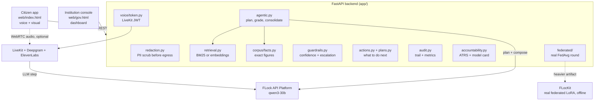
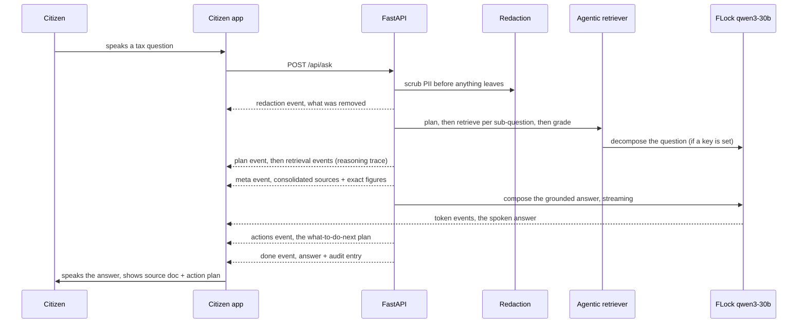
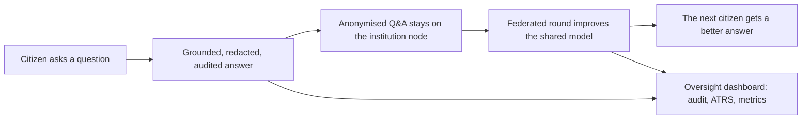
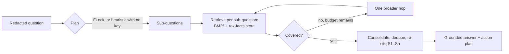
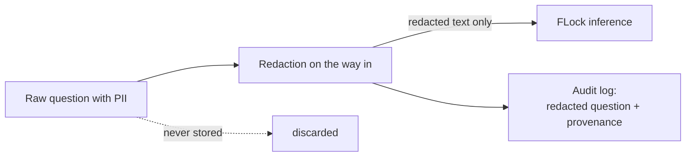
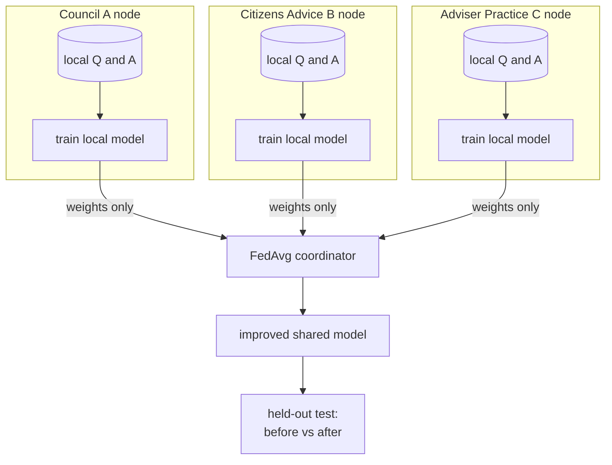

# Tributo

**Sovereign, privacy-preserving, auditable UK tax guidance, built on FLock's decentralised AI.**

Tributo is a voice-first AI tax advisor for UK citizens. A person speaks a tax question in plain
English. Tributo answers with guidance that is grounded in and cited to real GOV.UK and HMRC
sources, shows the citizen the exact source document and points at the passage it used, redacts
personal data before anything leaves the device, gives them a clear list of what to do next, and
records every interaction in an auditable, accountable trail.

It is built for the FLock hackathon, **Public Sector and Citizen Services** theme, which asks:
*how can AI improve public services while protecting citizens' privacy and ensuring public
accountability?* Tributo answers that question on both axes at once.

---

## Table of contents

1. [The problem](#the-problem)
2. [What Tributo is](#what-tributo-is)
3. [How it answers the track](#how-it-answers-the-track)
4. [What we have built](#what-we-have-built)
5. [The two surfaces, one engine](#the-two-surfaces-one-engine)
6. [User flow: the citizen side](#user-flow-the-citizen-side)
7. [User flow: the government side](#user-flow-the-government-side)
8. [The loop that connects both sides](#the-loop-that-connects-both-sides)
9. [System design and architecture](#system-design-and-architecture)
10. [Auditable agentic retrieval](#auditable-agentic-retrieval)
11. [Privacy by design](#privacy-by-design)
12. [Federated learning](#federated-learning)
13. [Accountability artifacts](#accountability-artifacts)
14. [Tech stack](#tech-stack)
15. [Project structure](#project-structure)
16. [API reference](#api-reference)
17. [Quickstart](#quickstart)
18. [Configuration](#configuration)
19. [Optional extras](#optional-extras)
20. [Testing](#testing)
21. [Honest claims](#honest-claims)
22. [Roadmap](#roadmap)
23. [Demo script](#demo-script)

---

## The problem

Tax is confusing for most people. Professional advice is expensive and out of reach for the people
who need it most: the self-employed, gig and platform workers, first-time Self Assessment filers,
and people with low digital or literacy confidence. HMRC's own channels are stretched thin.

Tax questions also expose some of the most sensitive personal data a citizen has: income, benefits,
National Insurance number, and personal circumstances. That data cannot responsibly be routed to a
centralised, foreign-controlled cloud AI. This is the centralisation problem applied to public
services, where a handful of providers would control the model, the data, and the access, with
incentives that do not align with the UK public interest.

Tributo widens access to tax help while keeping the citizen's data private and every answer
accountable to both the citizen and a regulator.

## What Tributo is

Tributo turns one spoken question into four things the citizen receives together:

1. A spoken, plain-English answer.
2. A live view of the system's reasoning, so the citizen sees how the answer was reached.
3. The real GOV.UK or HMRC source document, with the cited passage highlighted.
4. An action plan: an ordered, dated, sourced list of what to do next, that persists so the citizen
   can return and tick steps off over time.

Behind that experience, the citizen's personal data is redacted before any inference call, the
model improves across institutions through federated learning without anyone pooling raw data, and
every interaction is written to an auditable trail.

## How it answers the track

The track question has two halves. Tributo is engineered so each half is load-bearing, not bolted
on.

| Pillar | How Tributo delivers it |
|---|---|
| **Protecting privacy** | Personal identifiers are redacted before any text reaches inference, and the redacted payload is shown to the citizen so they can see exactly what left the device. Raw text is never retained. Model improvement runs through federated learning, where raw citizen data never leaves an institution's node. |
| **Public accountability** | Every factual claim is cited to a GOV.UK or HMRC source. Exact figures come from a curated fact table, not the model's memory. The full reasoning trace, sources, model version, confidence, and redactions are written to an exportable audit log. A UK Algorithmic Transparency Recording Standard (ATRS) record and a model card are served from the API. High-stakes or unsupported questions are escalated to a human instead of being answered. |

## What we have built

**Built and verified today.** The full Python backend and two reference front ends. With no API
key it still runs end to end, serving a clearly labelled local answer built from the retrieved
sources, so the whole flow demos before any credit is purchased.

**Turns on with a key.** Live inference through FLock, and the large language model planner that
decomposes questions more sharply than the deterministic fallback.

**Optional.** Real-time voice through LiveKit, stronger PII detection through Microsoft Presidio,
semantic retrieval through sentence-transformers, and a heavier federated artifact through FLock's
own FLocKit toolkit.

**Articulated, not built.** Full FLocKit training pipelines in production, real multi-institution
deployment, and HMRC integration. These are described in the pitch and not claimed as built.

## The two surfaces, one engine

Tributo presents two completely different surfaces over a single backend.



- **Citizen app at `/`** is voice and visual. It is the dominant way a citizen talks to the
  platform.
- **Institution console at `/gov.html`** is a dashboard. It is how councils, Citizens Advice,
  advisers, and eventually HMRC operate, collaborate, and oversee the service. Citizens never see
  it.

Both are throwaway reference mocks. The production front end is rebuilt in Lovable against the same
API.

## User flow: the citizen side

The dominant channel is voice and visual. The citizen never touches a setting or a dashboard. Their
whole world is: speak, hear, see the proof, follow the steps.

**A worked example.** Maya rides for Deliveroo. She opens Tributo and taps the microphone.

> "I started riding for Deliveroo in May, I made about thirty-four thousand. What do I actually need
> to do?"

As the advisor speaks back, the screen assembles in sync with its voice:

1. **The reasoning ribbon.** Maya sees the system break her question into sub-questions, for example
   "do I need to register", "by when", and "what will I owe", along with which sources it pulled and
   how well each one covered the question. The answer is not a black box.
2. **The evidence.** When the advisor says she must register by 5 October, the real GOV.UK "Register
   for Self Assessment" page appears with that exact line highlighted. Exact figures such as
   12,570 pounds and 1,000 pounds show as fact chips, each one clickable to its source.
3. **What to do next.** A dated action plan appears: register for Self Assessment by 5 October, keep
   records of income and expenses, file online by 31 January, pay the bill by 31 January. A short
   timeline shows the deadlines in order.

Underneath all of it, her name, National Insurance number, and income were redacted before any text
reached FLock. She can open the privacy view and see exactly what left the device. If she had asked
something high stakes, for example how to not declare some income, the advisor would have stopped and
routed her to a human instead of answering.

The action plan persists. When Maya comes back next week, the advisor remembers she is on step two,
keeps the steps she has ticked off, and reminds her the 5 October deadline is close. It is a guide
through a process, not a single question and answer.

Here is the request lifecycle for one citizen question.



## User flow: the government side

The same engine drives a completely different surface. Institutions never see the voice app. They
operate the dashboard at `/gov.html`.

| Role | What they do in the console |
|---|---|
| **Institution data or AI lead** (council, Citizens Advice) | The **Federated** tab. Opt the node into a federated round, run it, watch the shared model's tax accuracy improve, and see the proof that zero raw rows left the building. This is the collaboration: institutions make the shared model better on their own caseload without pooling citizen data. |
| **Compliance or oversight officer** | The **Overview** and **Oversight** tabs. Headline metrics (questions answered, escalation rate, grounded rate, PII items redacted), the live audit trail, the ATRS transparency record, and the model card. This is where public accountability physically lives. |
| **Human caseworker or adviser** | The **Escalations** tab. When the AI escalates a high-stakes question, a human picks it up here with the full redacted context and the reasoning trace. |
| **Service owner or admin** | The **Settings** tab. The model, redaction policy, retrieval backend, escalation thresholds, and corpus. Read-only in the prototype, configured per institution in a real deployment. |

The government side is the operator console for the three things the citizen never sees: improving
the model together through federation, proving the service is accountable, and catching what the AI
hands off.

## The loop that connects both sides



The citizen gets a private, accessible advisor. The institutions get a model that improves across
all of them without anyone surrendering data. The regulator gets a glass box. The two front ends are
just two windows onto this one loop.

## System design and architecture

The backend is a single FastAPI application. A citizen request flows through a clear pipeline, and
the government dashboard reads aggregate views over the same data.

**Request pipeline for a citizen answer.**


The same redacted question, the consolidated sources, the exact figures, the guardrail decision, the
reasoning trace, and the action plan are all assembled before the answer streams, then logged. The
dashboard's metrics, escalation queue, and audit views are computed from that log.

## Auditable agentic retrieval

The retrieval is not single-pass. It is a bounded agent loop, and every step is captured in a trace
that lands in the audit log, so the reasoning itself becomes part of the transparency record.



The steps are:

1. **Plan.** Decompose the redacted question into the minimal set of self-contained sub-questions.
   With a key this runs through FLock. With no key a deterministic split runs, so the loop still
   works and stays auditable.
2. **Retrieve.** For each sub-question, fetch grounded sources and match exact figures from the
   structured tax-facts store. If a sub-question comes back empty and budget remains, take one
   broader retrieval hop.
3. **Grade.** Compute term coverage per sub-question. This is deterministic on purpose, because a
   coverage number a judge can check is stronger for accountability than an opaque self-grade.
4. **Consolidate.** Deduplicate the union of sources, re-cite them S1 to Sn, and gather the facts.
5. **Compose.** Stream the grounded answer, using the tax-facts figures exactly as given.

The tax-facts store is a curated structured fact table, not a knowledge graph. It grounds the exact
numbers and dates, for example the personal allowance of 12,570 pounds, the 5 October registration
deadline, and the 1,000 pound trading allowance, so those values come from a table rather than the
model's memory. We call this auditable agentic retrieval, and we do not claim a knowledge graph.

## Privacy by design

Personal identifiers are scrubbed before anything is sent to inference, and the raw text is never
stored or returned. Callers only ever see the redacted text plus the types and counts of what was
removed.



The default redactor is a UK-specific regex pass that covers National Insurance numbers, Unique
Taxpayer References, postcodes, pound amounts, phone numbers, emails, and names. It deliberately over
matches the strict National Insurance number rules, because for a redactor it is safer to redact
anything shaped like an identifier. An optional Microsoft Presidio backend adds named-entity
detection and is aligned with ICO data-minimisation guidance.

The redacted payload is shown to the citizen in the privacy view, so the privacy claim is something
they can see, not just something we assert.

## Federated learning

Model improvement runs through federated averaging. Every institution trains a model on its own
private data and shares only model weights. A coordinator averages the weights. The aggregated model
is scored on a held-out set that spans every topic. Raw rows never leave a node.



The live demo runs a real FedAvg round in well under a second. It uses a small multinomial logistic
regression on TF-IDF features, where the feature space comes from the public GOV.UK corpus and never
from citizen questions. The three nodes are deliberately non-IID: each one only sees its own
specialism, so no single node does well on the full test set, and federating their weights beats any
single node. The result is genuine: a single institution's model scores around 37 percent on the
global test, and the federated model scores around 70 percent, with zero raw rows shared. Because the
training is real and unseeded, the numbers vary run to run.

For the heavier "we ran FLock's own toolkit" artifact, a federated LoRA fine-tune of a small language
model using FLocKit, follow `scripts/run_flockit.md` and capture the before and after evaluation
loss. The live path is demo-safe and instant. The FLocKit path is the pitch-credibility artifact and
is run offline ahead of time.

## Accountability artifacts

The accountability half of the track is concrete, not a slogan. The API serves a regulator-shaped
dossier.

- **ATRS transparency record** at `GET /api/transparency`. A UK Algorithmic Transparency Recording
  Standard record, the format central-government bodies publish for citizen-facing algorithmic tools,
  with tier 1 and tier 2 sections covering ownership, how it works, the decision process, the tool
  specification, the data, and the risks and mitigations.
- **Model card** at `GET /api/model-card`. A Mitchell et al. style model card, including explicit
  out-of-scope uses such as binding determinations, filing to HMRC, and advice on avoidance.
- **Audit trail** at `GET /api/audit`. An append-only, exportable log. It stores only the redacted
  question, never the raw input, plus the provider, model, confidence, redactions, sources, the exact
  outbound payload, and the reasoning trace.
- **Human escalation.** High-stakes or unsupported questions are escalated to a human and surfaced in
  the dashboard's escalation queue.

## Tech stack

| Layer | Choice | Why |
|---|---|---|
| Language | Python 3.11 or newer | The team's preferred stack; strong ML and web ecosystem. |
| Package manager | uv | Fast, modern, reproducible. |
| Web framework | FastAPI and Uvicorn | Async, typed, OpenAPI out of the box. |
| Streaming | sse-starlette for Server-Sent Events, httpx for the async FLock client | Token streaming to the citizen, streaming reads from FLock. |
| Inference | FLock API Platform, model qwen3-30b-a3b-instruct-2507, OpenAI-compatible, header x-litellm-api-key | Sovereign, low-cost, open-source inference. Falls back to a local answer with no key. |
| Retrieval | rank-bm25 by default, sentence-transformers optional | Lightweight and instant by default, semantic when wanted. |
| Redaction | regex by default, Microsoft Presidio optional | Always works; stronger NER when installed. |
| Federated ML | numpy and scikit-learn for the live FedAvg, FLocKit for the real toolkit artifact | Instant and demo-safe live, real toolkit offline. |
| Voice | LiveKit Agents, Deepgram STT, ElevenLabs TTS | Production-grade real-time voice with synchronized UI events. |
| Validation and config | pydantic and pydantic-settings | Typed requests and env configuration. |
| Tests and lint | pytest and ruff | 16 tests, clean lint. |
| Reference front end | Vanilla HTML, CSS, JavaScript, plus the browser Web Speech API | A working reference that drives the real API. |
| Production front end | Lovable | Rebuilds both surfaces against the same API. |

## Project structure

```
app/
  main.py            FastAPI app and all routes
  config.py          settings, loaded from environment or .env
  flock.py           FLock inference client: streaming answer, non-streaming planner, fallback
  agentic.py         auditable agentic retrieval: plan, retrieve with hops, grade, consolidate
  retrieval.py       grounded retrieval over the GOV.UK corpus, BM25 or embeddings
  redaction.py       PII minimisation, regex by default, Presidio optional
  guardrails.py      confidence labels and human escalation
  actions.py         turns an answer into a grounded, dated what-to-do-next plan
  plans.py           per-citizen action plan store, persists across questions
  audit.py           append-only audit trail and dashboard metrics
  accountability.py  ATRS transparency record and model card
  corpus/
    sources.py       the UK tax-guidance corpus
    facts.py         structured tax-facts store, exact figures
  federated/
    data.py          synthetic non-IID per-institution datasets
    fedavg.py        a real federated averaging round
  voice/
    token.py         mints LiveKit room tokens
    agent.py         the LiveKit voice advisor worker, a separate process
web/
  index.html         citizen app, voice and visual, with the action plan
  gov.html           institution console, the dashboard
  app.js, gov.js, styles.css
tests/               redaction, retrieval, federated, agentic, actions
scripts/
  run_flockit.md     recipe for the real FLocKit federated LoRA artifact
SPEC.md              the authoritative build spec and API contract
```

## API reference

The Lovable front end and the mock front ends all consume the same API.

| Method | Path | Purpose |
|---|---|---|
| GET | `/api/health` | Is FLock configured, the model, the redactor and retriever in use, is voice configured, corpus size. |
| POST | `/api/ask` | Streaming agentic answer as Server-Sent Events. Body `{question, citizen}`. Event order below. |
| POST | `/api/chat` | Non-streaming version. Returns answer, citations, sub-questions, trace, actions, plan, redaction, confidence, escalate, audit. |
| GET | `/api/source/{id}` | Full corpus document, for the document panel. |
| GET | `/api/sources` | List the corpus. |
| GET | `/api/plan` | The citizen's persisted action plan. Query `?citizen=`. |
| POST | `/api/plan/toggle` | Tick a step off. Body `{citizen, id}`. |
| POST | `/api/federated/run` | Run a real FedAvg round. Returns nodes, before and after accuracy, provenance, timeline. |
| GET | `/api/transparency` | The UK ATRS transparency record. |
| GET | `/api/model-card` | The model card. |
| GET | `/api/audit` | The session audit log, exportable. |
| GET | `/api/metrics` | Dashboard headline numbers: totals, escalation rate, grounded rate, PII items removed. |
| GET | `/api/escalations` | The human escalation queue. |
| GET | `/api/settings` | Read-only deployment configuration. |
| POST | `/api/voice/token` | Mint a LiveKit room JWT. Returns 503 until voice is configured. |

**SSE event order for `/api/ask`:**

```
redaction   what PII was removed
plan        the sub-questions and which planner produced them
retrieval   one per sub-question: coverage, covered, hops, sources, facts
meta        consolidated sources, guardrails, the exact outbound payload, the facts
actions     the what-to-do-next plan, plus the persisted plan
token       repeated, the streamed spoken answer
done        the final answer and the audit entry, including the reasoning trace
```

**Live UI events over the LiveKit data channel, topic `ui-highlight`:**

```json
{ "type": "highlight_doc", "docId": "register-self-assessment" }
{ "type": "cite", "sources": ["register-self-assessment", "income-tax-rates"] }
```

## Quickstart

```bash
uv sync
cp .env.example .env          # optional: add FLOCK_API_KEY for live inference
uv run uvicorn app.main:app --reload
```

Then open:

- Citizen app: http://127.0.0.1:8000/
- Institution console: http://127.0.0.1:8000/gov.html

With no `FLOCK_API_KEY` the app still runs the full flow and serves a clearly labelled local answer
built from the retrieved sources. Add a key, with credits purchased at platform.flock.io, to route
real inference through FLock and to turn on the large language model planner.

## Configuration

All settings load from the environment or a `.env` file. See `.env.example`.

| Variable | Default | Purpose |
|---|---|---|
| `FLOCK_API_KEY` | empty | FLock API key. Empty means local fallback mode. |
| `FLOCK_BASE_URL` | `https://api.flock.io/v1` | The OpenAI-compatible base URL. |
| `FLOCK_MODEL` | `qwen3-30b-a3b-instruct-2507` | The model id. |
| `REDACTOR` | `auto` | `auto`, `presidio`, or `regex`. |
| `RETRIEVER` | `bm25` | `bm25` or `embeddings`. |
| `LIVEKIT_URL`, `LIVEKIT_API_KEY`, `LIVEKIT_API_SECRET` | empty | LiveKit, for voice. |
| `DEEPGRAM_API_KEY` | empty | Deepgram STT, for voice. |
| `ELEVEN_API_KEY` | empty | ElevenLabs TTS, for voice. Note the variable name is ELEVEN, not ELEVENLABS. |
| `VOICE_ID` | a default voice | The ElevenLabs voice id. |

## Optional extras

```bash
uv sync --extra presidio     # Microsoft Presidio NER redaction, then: python -m spacy download en_core_web_lg
uv sync --extra embeddings   # semantic retrieval with sentence-transformers instead of BM25
uv sync --extra voice        # the LiveKit Agents voice worker
```

**Voice (LiveKit, ElevenLabs, FLock).** Fill the LiveKit, Deepgram, and ElevenLabs keys in `.env`,
then run the agent worker, which is a separate process from the API:

```bash
uv run python app/voice/agent.py dev
```

The worker routes its language model step to FLock, uses Deepgram for speech to text and ElevenLabs
for text to speech, and pushes highlight events over the LiveKit data channel so the front end
highlights the document the advisor is citing as it speaks.

**Real FLock federated toolkit.** The live federated round at `/api/federated/run` is a real FedAvg
round we run ourselves. To produce the heavier federated LoRA artifact using FLock's own FLocKit
toolkit, follow `scripts/run_flockit.md` and capture the before and after evaluation loss.

## Testing

```bash
uv run pytest -q       # 16 tests: redaction, retrieval, federated, agentic, actions
uv run ruff check app tests
```

## Honest claims

What Tributo can truthfully say, and what it must not.

**We can claim.** Personal data is redacted before egress and never retained. Federated training
keeps data in jurisdiction, and only weights are shared. Inference is the open-source qwen3-30b on
the FLock API Platform. The federated improvement is real and measurable, before and after, on a
held-out set. The accountability artifacts are real: an ATRS record, a model card, cited answers, an
audit log, and a human escalation path.

**We must not claim.** That the hosted FLock inference API keeps data in a specific region, because
the region is not disclosed, which is exactly why we redact before the call. That the federated round
runs on chain or is staked, because that is out of scope. That Tributo gives real or binding tax
determinations. That the retrieval is a knowledge graph, because the tax-facts store is a curated
structured fact table. Non-IID per-client data only as far as the demo actually shards it. Streaming
and tool-calling through FLock until they are live-tested.

## Roadmap

- Live inference and the language model planner, once FLock credits are purchased.
- Real-time voice, once LiveKit, Deepgram, and ElevenLabs keys are added, plus a day-one test of
  FLock streaming and tool-calling through the LiveKit pipeline.
- The production front end rebuilt in Lovable, for both the citizen app and the institution console,
  against the API in `SPEC.md`.
- A real per-user store for action plans, replacing the in-memory store.
- The heavier FLocKit federated LoRA artifact, captured ahead of the demo.

## Demo script

A short, scored pitch in roughly three minutes.

1. The citizen problem, twenty seconds. Tax is hard, advice is unaffordable, and the data is among
   the most sensitive there is.
2. The live demo, sixty seconds. A spoken or typed question, the reasoning trace, the cited answer,
   the source document highlighted, and the action plan. Show the redacted payload. Trigger one human
   escalation.
3. Why this needs FLock, forty seconds. Sovereignty through redaction and federation, and the
   federated loop improving the model across institutions without pooling data. Show the before and
   after.
4. The two sides, twenty seconds. Switch to the institution console and show the federated round and
   the oversight dashboard.
5. Adoption, twenty seconds. Citizens Advice and a single council pilot first, wider rollout later,
   tied to the UK sovereign AI agenda.
